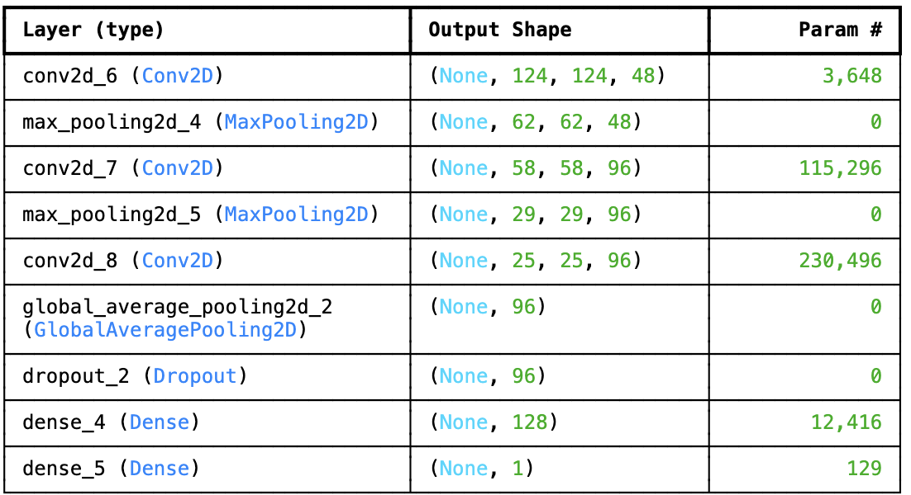
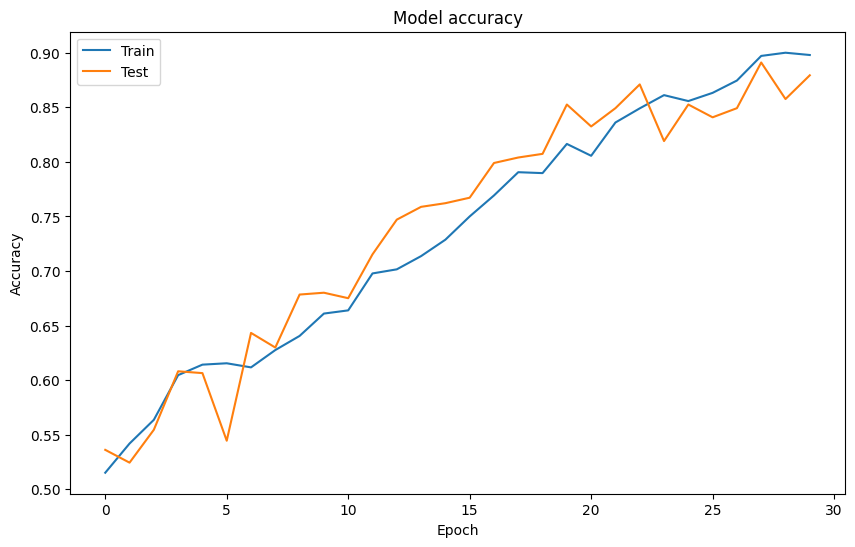
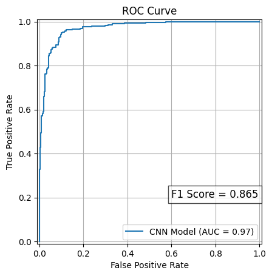

Page-Flip Image Classification

This project builds a computer vision model to detect whether a physical page is being flipped using a single image. Smartphone videos of page-turning actions were clipped into short segments, and individual frames were extracted and labeled as flipping or not flipping.

Dataset

Source: Smartphone-captured page-flipping videos

Frames saved using the pattern: VideoID_FrameNumber

Each frame labeled as:

0 → Not Flipping

1 → Flipping

Goal

Predict whether a single frame contains the action of a page flip.

Model

2-D Convolutional Model

Evaluation metric: F1 score

Results

Challenges

Detecting an action from a single still image

Ambiguous mid-transition frames

Potential improvement through multi-frame or video-based modeling

Next Steps

Extend dataset with more scenarios

Evaluate temporal models (video transformers, 3D CNNs)

Integrate OCR to measure downstream impact