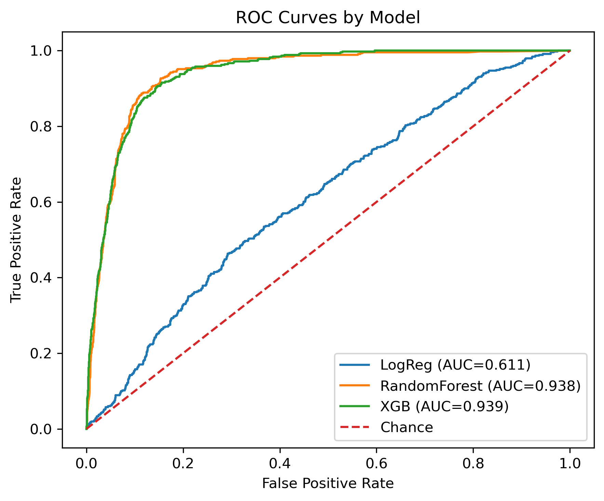
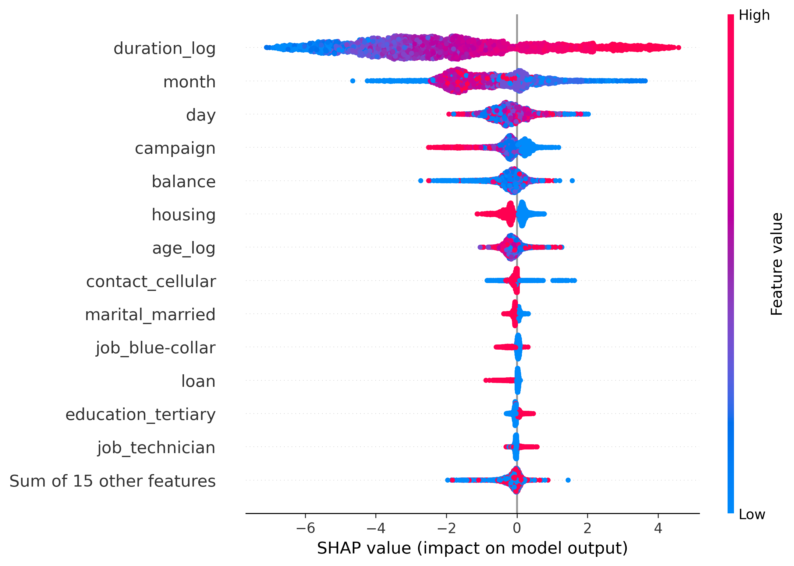

# Client Summary Report

## Project Objective
This project aimed to build and evaluate predictive models that identify customers most likely to subscribe to a **term deposit**.  
Primary performance metric: **F1**, emphasizing precision–recall balance for the minority (positive) class.

---

## Model Performance Overview

Three models were developed and compared:

| Model | Summary of Test Performance |
|-------|-----------------------------|
| **Logistic Regression** | Precision: 0.12 Recall: 0.49 F1-Score: 0.20 Accuracy: 0.66 |
| **Random Forest**  | Precision: 0.51 Recall: 0.73 F1-Score: 0.60 Accuracy: 0.92 |
| **XGBoost** | Precision: 0.51 Recall: 0.73 F1-Score: 0.60 Accuracy: 0.92 |

**XGBoost Best Parameters:**
```
learning_rate = 0.20
gamma = 0.26
max_delta_step = 1
scale_pos_weight = 12.6
```
**Comparison of ROC-AUC Across Models**


**Performance Summary**
- XGBoost achieved the **highest AUC-PR** and **ROC-AUC** values.
- Both tree-based models improved recall and precision for positive outcomes.
- Logistic Regression provided a reliable, interpretable baseline.

---

## Feature Importance Insights (Based on XGBoost Model)

<div style="display: flex; align-items: flex-start; gap: 20px;">

  <div style="flex: 1;">
    
  </div>

  <div style="flex: 1;">

| Rank | Feature | Global Influence |
|------|----------|------------------|
| 1 | **duration_log** | Longer call duration strongly increases the likelihood of subscription; short calls sharply decrease it. |
| 2 | **month** | Calls made later in the year are more likely to lead to a subscription than those made earlier. |
| 3 | **day** | Calls made later in the month tend to have a higher success rate, though the effect is moderate. |
| 4 | **campaign** | More contact attempts generally reduce the chance of success; fewer contacts slightly improve it. |
| 5 | **balance** | Higher customer account balances modestly increase the likelihood of subscription. |
| 6 | **housing** | Customers without a housing loan are somewhat more likely to subscribe. |
| 7 | **age_log** | Older customers show a slight tendency toward subscription, though the effect is weaker. |
| 8 | **contact_cellular** | Contacting customers via cellular service marginally improves success compared to other methods. |
| 9 | **marital_married** | Married customers show a small positive influence on subscription likelihood. |
| 10 | **job_blue-collar** | Blue-collar occupations slightly reduce the chance of subscription. |

  </div>
</div>


---

## Conclusions

- **XGBoost** provided the strongest predictive precision and generalization.
- **Duration** and **past campaign success** were the top predictive drivers.
- The model suite is **interpretable, scalable, and business-ready**.

**Recommended Next Steps**
1. Deploy XGBoost for live campaign predictions.  
2. Integrate SHAP-based visualization dashboard.  
3. Retrain quarterly with updated customer data.

---
